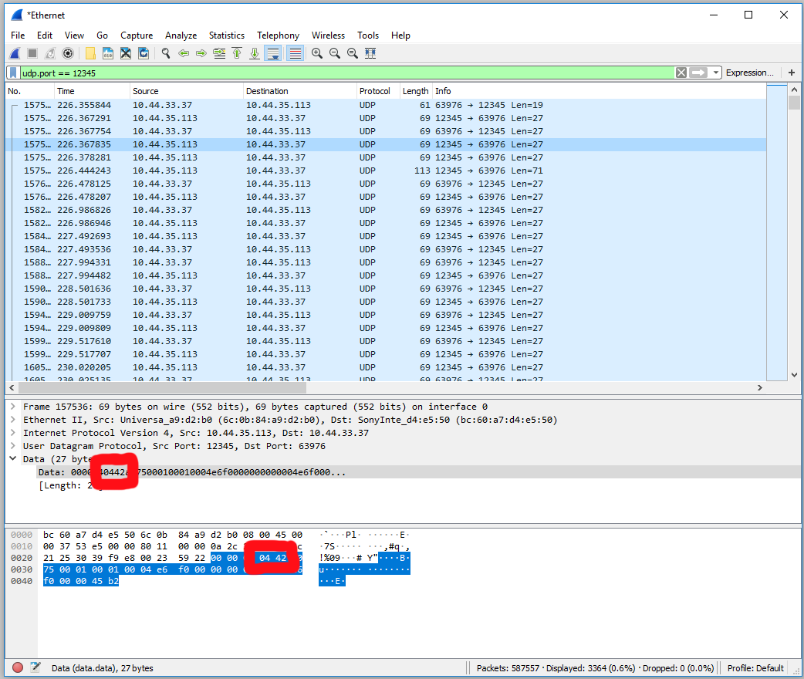

# Detection and Processing of Duplicate Packets

The UNet protocol has support for detecting duplicate packets.  A machine might receive duplicate packets either by accident (IP itself makes no guarantees against it), or due to a replay attack, where a man-in-the-middle attacker resends packets that they have previously captured.

Every packet sent by NetworkTransport has a sequence number.  The sequence number is an unsigned 16-bit value that increments by one on each sent packet, and wraps at 65535 back to zero.  These are visible in packet captures of unencrypted communication, as the fourth and fifth bytes.  

When the client first connects to a server, it picks a random sequence number to start off with, and places that in its connection request packet. The server does the same in its acknowledgement. So for a single connection there are two incrementing sequence numbers; one for traffic going from the client to the server, and one for traffic going in the other direction.

From that point on, each side keeps track of two things:

1. The highest number packet that has been received so far.
1. A C++ `std::bitset` that records whether the 512 previous packets up to and including that one have already been received. (So the zero'th bit is always one).

When a packet is received, the following actions are taken:
1. If the sequence number of the received packet is higher than the highest received so far, then the packet is newer than any we have received so far. It is an _in-order_ packet. **This is the usual case**.
    1. We shift the bitset along by the relevant amount. So for example if the highest received packet is #354 and we receive packet #358, then the bitset is shifted 4 to the left.
    1. If the amount to shift is too high (>512), then it signifies that too many packets have not been received in the meantime. In this case the connection is dropped.
    1. Otherwise, we record this packet's sequence number as the highest sequence number received, and set `bitset[0]`.
1. If the sequence number of the received packet is lower than the highest received so far, then this is an _out-of-order_ packet; it is older than the newest one that the recipient has seen at that point. It might be a replayed packet that we have received already, either due to an attack or just innocent packet duplication somewhere along the way.
    1. We use the bitset to see if that sequence number has already been received.
        * For example if the highest received packet is #354 and we receive packet #352, we check bitset[2] (that is, the third bit).
    1. If the packet has been received already, then it is dropped with **no further processing**.
    1. Likewise, if the packet is so old that it is not even in the bitset (i.e. it is more than 512 behind) then it is dropped with **no further processing**.
    1. Otherwise, if the packet has *not* been received already, then the corresponding bit it set in the bitset and the packet is processed.

There are a couple of important points to note:
1. The same code detects (and drops) duplicate packets, as well as noticing when there has been massive packet loss, leading to dropping the entire connection.
1. Because the sequence number is within the encrypted (and HMAC'd) payload, it cannot be altered by an attacker. If it was, then the HMAC check would fail prior to decryption. An attacker could duplicate the packet, but it would be dropped by the system described above, straight after decryption.